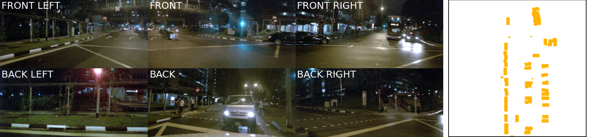
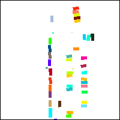
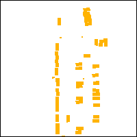

# FIERY BEV dataloader

# Download data and install requirements

```
!mkdir -p data/sets/nuimages  # Make the directory to store the nuImages dataset in.

!mkdir -p data/sets/nuscenes

!wget https://www.nuscenes.org/data/nuimages-v1.0-mini.tgz  # Download the nuImages mini split.

!tar -xf nuimages-v1.0-mini.tgz -C data/sets/nuimages  # Uncompress the nuImages mini split.

!wget https://www.nuscenes.org/data/v1.0-mini.tgz  # Download the nuScenes mini split.

!tar -xf v1.0-mini.tgz -C data/sets/nuscenes  # Uncompress the nuScenes mini split.

!pip install nuscenes-devkit &> /dev/null  # Install nuscenes.

!pip install fvcore

!pip install -U lyft_dataset_sdk
```

# Assert Download

Check if data is downloaded correctly, by running:

`python assert_download.py --dataroot <path to nuscenes folder> --version <eg. v1.0-mini>`

# Configs

## In `config.py` set the following:

Set `_C.DATASET.DATAROOT = 'data/sets/nuscenes'` according to download path

Leave `_C.DATASET.VERSION = ''` as an empty string

`config.py` has the config parser. The other configs can be found in `baseline.yml` and `single_timeframe.yml`. 

Only `N_WORKERS` need to be set in `baseline.yml`

# Dataloader

`data.py` has the definition of dataloader.

The only changes made made are in:
1. `L#260` to consider all classes and not only vehicle classes
2. `L#437` to load the NuScenes mini dataset with the datapath in `config.py`

# Visualise

The knack in displaying all classes is in tis file.

Functions of interest: `plot_prediction` (uses `plot_instance_map` in `visualisation.py`) and `visualise` (uses `plot_prediction`)

`plot_instance_map` starts with a blank white image of (200,200,3) and fills colors to instances segmented (only cars as of now) in the image - rest of the background remains white.

Need to find the solution for this.

# Test

To get the below results, run:

`python test.py`

## Results







