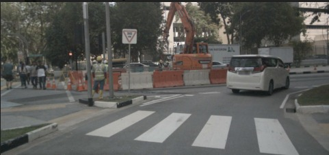
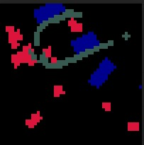

# FIERY BEV dataloader

# Download data and install requirements

```
!mkdir -p data/sets/nuscenes # Make the directory to store the nuScenes dataset in.
!wget https://www.nuscenes.org/data/v1.0-mini.tgz  # Download the nuScenes mini split.
!tar -xf v1.0-mini.tgz -C data/sets/nuscenes  # Uncompress the nuScenes mini split.

!pip install nuscenes-devkit &> /dev/null  # Install nuscenes.
!pip install fvcore
!pip install -U lyft_dataset_sdk
```

# Assert Download

Check if data is downloaded correctly, by running:

```
python assert_download.py --dataroot <path to nuscenes folder> --version <eg. v1.0-mini>
```

# Configs

## In the configs flder, refer `config.py` to set the following:

Set `_C.DATASET.DATAROOT = 'data/sets/nuscenes'` according to download path

Leave `_C.DATASET.VERSION = ''` as an empty string

`config.py` has the config parser. The other configs can be found in `baseline.yml` and `single_timeframe.yml`. 

Only `N_WORKERS` need to be set in `baseline.yml`. The path to `baseline.yml` can be set `get_cfg` function of `config.py`


# Test

To get the below results, run:

```
python collect_bev_data.py --rgb <path to save RGB images> --seg <path to save segmentation labels with Carla mapping> --seg_viz <path to save segmentation labels visualization>
```

## Results

| RGB      | BEV Segmentation label | 
| :----:       |    :----:   |   
|       |        |


