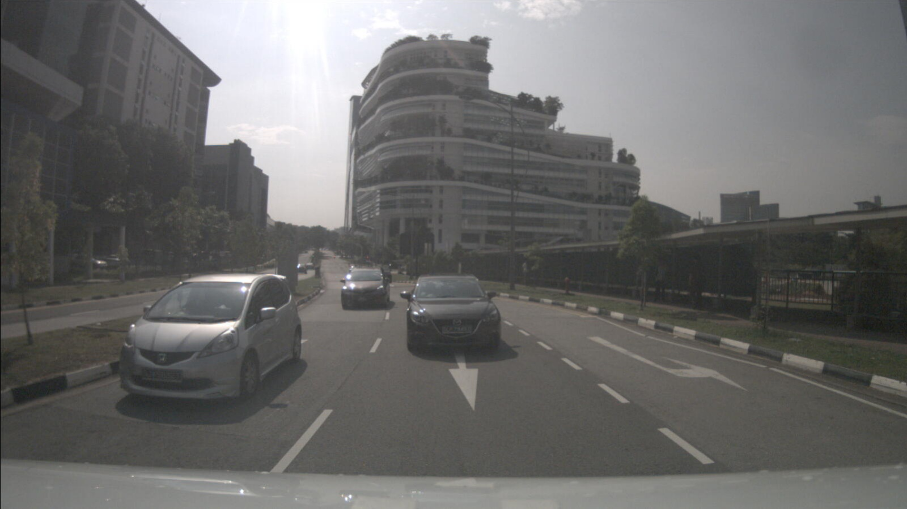
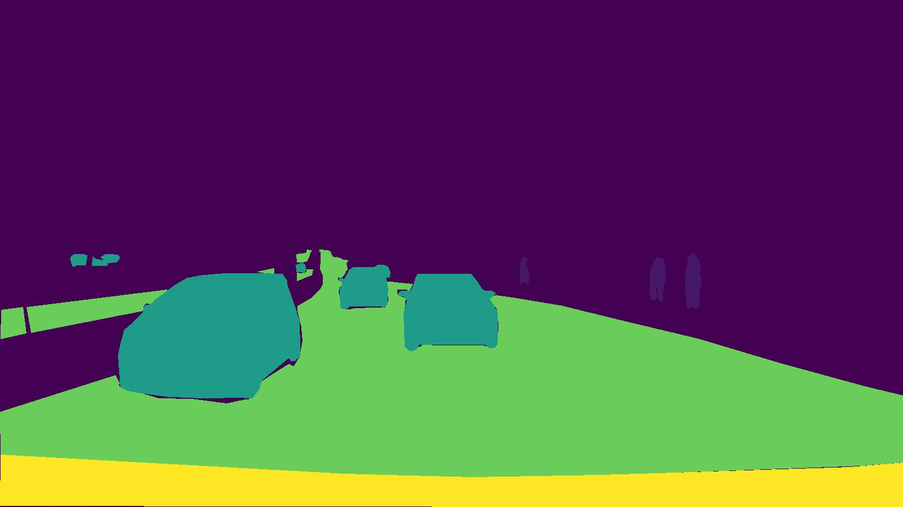

# nuImages_dataset

# Install requirements

```
!pip install nuscenes-devkit &> /dev/null  # Install nuscenes.

!pip install fvcore
```

# Download nuImages datset 

Under All, download Samples and Metadata from [nuImages dataset](https://www.nuscenes.org/nuimages#download).

Should have files `nuimages-v1.0-all-samples` and `nuimages-v1.0-all-metadata`

Extract files using: 

```
!tar -xf nuimages-v1.0-all-samples.tgz -C data/sets/nuimages

!tar -xf nuimages-v1.0-all-metadata.tgz -C data/sets/nuimages
```

# Testing nuImages

# Basic usage

```python
import cv2
from nuimages import NuImages

nuim = NuImages(dataroot='data/sets/nuimages', version='v1.0-train', verbose=True, lazy=True)

sample_idx = 2
sample = nuim.sample[sample_idx]
key_camera_token = sample['key_camera_token']
sample_data = nuim.get('sample_data', key_camera_token)
img_path = os.path.join('data/sets/nuimages', sample_data['filename'])

img = cv2.imread(img_path)
cv2.imshow("RGB Image", img)

semantic_mask, _ = nuim.get_segmentation(key_camera_token)
cv2.imshow("Semantic Mask", semantic_mask)
```

# Collecting the segmentation dataset

If running on Colab terminal, run

```
python collect_dataset.py --data train --dataroot "data/sets/nuimages" --type "front"
```

Will create dataset in the form:

```
${ROOT_FOLDER}
|-- front
    |-- rgb
    |   |-- 000001.jpg
    |   |-- 000002.jpg
    |   |-- ...
    |-- seg
    |   |-- 000001.jpg
    |   |-- 000002.jpg
    |   |-- ...
```

`${ROOT_FOLDER} = /content/{train, val, test}`

A ZIP file (i.e. {train, val, test}.zip) of the dataset will be saved in `"/content/drive/MyDrive/VLR/project"` (folder will be created)

# Download segmentation dataset

Download: [nuImages segmentation dataset](https://drive.google.com/drive/folders/1qV4G34PEElAhbfiRtxpvUUZ85zvwbPOh?usp=sharing).

# Samples

| RGB | Segmentation  | 
| :---   |  :----:    | 
|  |  |

# Category name to Class ID mapping

Refer `name_to_index.json`

```json
{
    "animal": 1,
    "human.pedestrian.adult": 2,
    "human.pedestrian.child": 3,
    "human.pedestrian.construction_worker": 4,
    "human.pedestrian.personal_mobility": 5,
    "human.pedestrian.police_officer": 6,
    "human.pedestrian.stroller": 7,
    "human.pedestrian.wheelchair": 8,
    "movable_object.barrier": 9,
    "movable_object.debris": 10,
    "movable_object.pushable_pullable": 11,
    "movable_object.trafficcone": 12,
    "static_object.bicycle_rack": 13,
    "vehicle.bicycle": 14,
    "vehicle.bus.bendy": 15,
    "vehicle.bus.rigid": 16,
    "vehicle.car": 17,
    "vehicle.construction": 18,
    "vehicle.emergency.ambulance": 19,
    "vehicle.emergency.police": 20,
    "vehicle.motorcycle": 21,
    "vehicle.trailer": 22,
    "vehicle.truck": 23,
    "flat.driveable_surface": 24,
    "vehicle.ego": 31
}
```

# Categories

Refer `category.json`

```json
[
{
"token": "63a94dfa99bb47529567cd90d3b58384",
"name": "animal",
"description": "All animals, e.g. cats, rats, dogs, deer, birds."
},
{
"token": "a86329ee68a0411fb426dcad3b21452f",
"name": "flat.driveable_surface",
"description": "Surfaces should be regarded with no concern of traffic rules, lanes etc. Exclude any road obstacles. This includes paved and unpaved surfaces"
},
{
"token": "1fa93b757fc74fb197cdd60001ad8abf",
"name": "human.pedestrian.adult",
"description": "Adult subcategory."
},
{
"token": "b1c6de4c57f14a5383d9f963fbdcb5cb",
"name": "human.pedestrian.child",
"description": "Child subcategory."
},
{
"token": "909f1237d34a49d6bdd27c2fe4581d79",
"name": "human.pedestrian.construction_worker",
"description": "Construction worker"
},
{
"token": "403fede16c88426885dd73366f16c34a",
"name": "human.pedestrian.personal_mobility",
"description": "A small electric or self-propelled vehicle, e.g. skateboard, segway, or scooters, on which the person typically travels in a upright position. Driver and (if applicable) rider should be included in the bounding box along with the vehicle."
},
{
"token": "e3c7da112cd9475a9a10d45015424815",
"name": "human.pedestrian.police_officer",
"description": "Police officer."
},
{
"token": "6a5888777ca14867a8aee3fe539b56c4",
"name": "human.pedestrian.stroller",
"description": "Strollers. If a person is in the stroller, include in the annotation."
},
{
"token": "b2d7c6c701254928a9e4d6aac9446d79",
"name": "human.pedestrian.wheelchair",
"description": "Wheelchairs. If a person is in the wheelchair, include in the annotation."
},
{
"token": "653f7efbb9514ce7b81d44070d6208c1",
"name": "movable_object.barrier",
"description": "Temporary road barrier placed in the scene in order to redirect traffic. Commonly used at construction sites. This includes concrete barrier, metal barrier and water barrier. No fences."
},
{
"token": "063c5e7f638343d3a7230bc3641caf97",
"name": "movable_object.debris",
"description": "Movable object that is left on the driveable surface that is too large to be driven over safely, e.g tree branch, full trash bag etc."
},
{
"token": "d772e4bae20f493f98e15a76518b31d7",
"name": "movable_object.pushable_pullable",
"description": "Objects that a pedestrian may push or pull. For example dolleys, wheel barrows, garbage-bins, or shopping carts."
},
{
"token": "85abebdccd4d46c7be428af5a6173947",
"name": "movable_object.trafficcone",
"description": "All types of traffic cone."
},
{
"token": "0a30519ee16a4619b4f4acfe2d78fb55",
"name": "static_object.bicycle_rack",
"description": "Area or device intended to park or secure the bicycles in a row. It includes all the bikes parked in it and any empty slots that are intended for parking bikes."
},
{
"token": "fc95c87b806f48f8a1faea2dcc2222a4",
"name": "vehicle.bicycle",
"description": "Human or electric powered 2-wheeled vehicle designed to travel at lower speeds either on road surface, sidewalks or bike paths."
},
{
"token": "003edbfb9ca849ee8a7496e9af3025d4",
"name": "vehicle.bus.bendy",
"description": "Bendy bus subcategory. Annotate each section of the bendy bus individually."
},
{
"token": "fedb11688db84088883945752e480c2c",
"name": "vehicle.bus.rigid",
"description": "Rigid bus subcategory."
},
{
"token": "fd69059b62a3469fbaef25340c0eab7f",
"name": "vehicle.car",
"description": "Vehicle designed primarily for personal use, e.g. sedans, hatch-backs, wagons, vans, mini-vans, SUVs and jeeps. If the vehicle is designed to carry more than 10 people use vehicle.bus. If it is primarily designed to haul cargo use vehicle.truck. "
},
{
"token": "5b3cd6f2bca64b83aa3d0008df87d0e4",
"name": "vehicle.construction",
"description": "Vehicles primarily designed for construction. Typically very slow moving or stationary. Cranes and extremities of construction vehicles are only included in annotations if they interfere with traffic. Trucks used to haul rocks or building materials are considered vehicle.truck rather than construction vehicles."
},
{
"token": "7754874e6d0247f9855ae19a4028bf0e",
"name": "vehicle.ego",
"description": "Ego vehicle."
},
{
"token": "732cce86872640628788ff1bb81006d4",
"name": "vehicle.emergency.ambulance",
"description": "All types of ambulances."
},
{
"token": "7b2ff083a64e4d53809ae5d9be563504",
"name": "vehicle.emergency.police",
"description": "All types of police vehicles including police bicycles and motorcycles."
},
{
"token": "dfd26f200ade4d24b540184e16050022",
"name": "vehicle.motorcycle",
"description": "Gasoline or electric powered 2-wheeled vehicle designed to move rapidly (at the speed of standard cars) on the road surface. This category includes all motorcycles, vespas and scooters."
},
{
"token": "90d0f6f8e7c749149b1b6c3a029841a8",
"name": "vehicle.trailer",
"description": "Any vehicle trailer, both for trucks, cars and bikes."
},
{
"token": "6021b5187b924d64be64a702e5570edf",
"name": "vehicle.truck",
"description": "Vehicles primarily designed to haul cargo including pick-ups, lorrys, trucks and semi-tractors. Trailers hauled after a semi-tractor should be labeled as vehicle.trailer"
}
]
```

